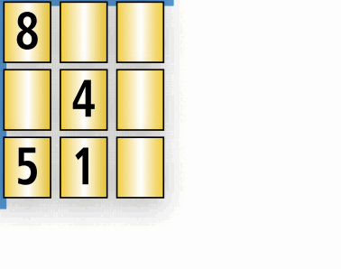

# Sudokopie

❔ A3 👥 00122 🧑 Leonhard Masche 📆 25.10.2022

## Lösungsidee

Die Idee zur Lösung basiert auf dem Brute-Force Lösungsweg. Da dieser mit $3!*3!*4*3!^3*3!^3*10!=2.4*10^{13}$ Kombinationsmöglichkeiten aber nicht in akzeptabler Zeit zu berechnen ist, wird sich einem Trick bedient: Die einzelnen Blöcke (3x3 Felder, 9 Blöcke) werden "gehasht" - also für jeden Block wird eine (nicht immer kollisionsfreie) Zahl berechnet - wodurch schnell geprüft werden kann, ob sich dieser Block an der richtigen Position befindet. Das ist möglich, da Spalten und Zeilen immer nur innerhalb eines Blockes verschoben werden dürfen.

## Umsetzung

Das Programm ist in Python umgesetzt und mit einer Umgebung ab der Version `3.8` ausführbar. Das Programm befindet sich in der Datei `program.py` in diesem Ordner.

Zuerst werden die beiden Sudokubretter in Matrizen geladen. Nun werden sie gehasht. Dabei wird jeder Block (3x3 Felder) zu einem einzigen Integer reduziert. Da sich die Werte der Zahlen ändern können, dürfen diese nicht zum Generieren dieses Wertes verwendet werden. Es wird für jede Reihe die Anzahl der Zahlen in dieser Reihe gezählt. Um den Wert 0 zu vermeiden, wird hier 1 addiert. Da sich die Reihenfolge der Reihen arbiträr ändern kann, werden mit Blick auf das Kommutativgesetz die einzelnen Werte multipliziert. Dieses Verfahren wird auch auf die Spalten des Blockes angewendet und die beiden Ergebnisse werden, um den finalen Hash zu erhalten addiert.


<i style="position:absolute;bottom:-20px;left: 5px">Demonstration des hashing-Algorithmus</i>

<br>

Nun wird zuerst die Kombination aus Spalten- und Zeilenblockverschiebung und Rotation überprüft ($3!*3!*4=144$ Möglichkeiten).
Wenn der Hash des ersten Bretts, auf das diese Veränderungen angewendet wurden dem Hash des zweiten Bretts gleich ist, wird diese Lösungsmöglichkeit genauer untersucht. Sollten die Hashes nicht übereinstimmen, ist sicher, dass dies nicht die Lösung ist. Durch das Überspringen von offensichtlich falschen Kombinationen, wird ein Großteil der Arbeit übersprungen (~142 von 144 Kombinationen werden hier übersprungen).

Wird jedoch eine Lösung weiter untersucht, wird durch alle Kombinationen von Spalten- und Zeilenverschiebungen iteriert ($3!^3*3!^3$). Für jede Kombination wird wiederum überprüft, ob sich beide Bretter - ausgenommen vom Umbenennen der Zahlen - übereinstimmen. Dazu wird in einem dictionary die Umbenennung von Zahlen gespeichert (`{1: 2, 9: 1, ...}`). Es wird durch die Matrizen iteriert. Sollte eine Zahl an dem betrachteten Index keine Zuordnung im dictionary haben, wird diese hinzugefügt. Wenn schon eine Zuordnung existiert, muss die Zahl im zweiten Brett der Zuordnung der Zahl vom ersten Brett übereinstimmen. So wird während dem Überprüfen der Lösung auch gleich die erforderte Umordnung der Zahlen erzeugt.

Zum Schluss werden die Ergebnisse formatiert ausgegeben.

## Beispiele

Hier wird das Programm auf die fünf Beispiele von der Website angewendet:

`sudoku0.txt`

```text

Die beiden Sudokus sind ähnlich!
- Vertauschen der Zeilen: 1 -> 2, 2 -> 1, 8 -> 9, 9 -> 8
- Vertauschen der Spalten: 1 -> 3, 2 -> 1, 3 -> 2, 4 -> 5, 5 -> 6, 6 -> 4, 7 -> 9, 9 -> 7

```

---

`sudoku1.txt`

```text

Die beiden Sudokus sind ähnlich!
- Vertauschung der Zeilenblöcke: 1 -> 2, 2 -> 1
- Vertauschung der Spaltenblöcke: 1 -> 2, 2 -> 1
- Drehung im Uhrzeigersinn um 270°
- Vertauschen der Zeilen: 1 -> 3, 3 -> 1, 4 -> 6, 6 -> 4, 7 -> 9, 9 -> 7
- Vertauschen der Spalten: 1 -> 3, 3 -> 1, 4 -> 6, 6 -> 4, 7 -> 9, 9 -> 7

```

---

`sudoku2.txt`

```text

Die beiden Sudokus sind ähnlich!
- Vertauschung der Spaltenblöcke: 1 -> 3, 3 -> 1
- Vertauschen der Zeilen: 5 -> 6, 6 -> 5
- Umbenennung der Zahlen: 4 -> 5, 9 -> 1, 8 -> 9, 5 -> 6, 3 -> 4, 1 -> 2, 6 -> 7, 7 -> 8, 2 -> 3

```

---

`sudoku3.txt`

```text

Die beiden Sudokus sind nicht ähnlich.

```

---

`sudoku4.txt`

```text

Die beiden Sudokus sind nicht ähnlich.

```

## Quellcode

`program.py`

```python
from itertools import chain, permutations, product
from os import path
from functools import reduce
from operator import mul
from typing import Any, Iterator, List, Mapping, Tuple


def r_path(path_: str) -> str:
    return path.join(
        path.dirname(path.abspath(__file__)),
        path_
    )


def hash(board: Tuple[Tuple[int]]) -> Tuple[Tuple[int]]:
    """hash each block into an int to return a matrix of 3x3 ints"""
    def hash_block(board: Tuple[Tuple[int]], x: int, y: int) -> int:
        return (
            reduce(mul, (sum(1 if i != 0 else 0 for i in board[x*3+xo][y*3: y*3+3]) + 1 for xo in range(3))) +
            reduce(mul, (sum((1 if board[x*3+xo][y*3+yo] != 0 else 0)
                   for xo in range(3)) + 1 for yo in range(3)))
        )

    return tuple(
        tuple(
            hash_block(board, j, i)
            for j in range(3)
        )
        for i in range(3)
    )


def load_boards(path_: str) -> List[Tuple[Tuple[int]]]:
    """load boards from file"""
    with open(r_path(path_), 'r', encoding="utf-8-sig") as f:  # how come encoding is still a problem?
        return [
            tuple(
                tuple(
                    int(i) for i in line.split()
                ) for line in board.split('\n')
            ) for board in f.read().split('\n\n')
        ]


def boards_match(board1: Tuple[Tuple[int]],
                 board2: Tuple[Tuple[int]],
                 xmapping: List[int],
                 ymapping: List[int]) -> Mapping[int, int]:
    """check if two boards are identical except for swapped numbers. return number mapping if they are"""
    number_mapping = {0: 0}
    for x in range(9):
        for y in range(9):
            if board1[xmapping[x]][ymapping[y]] in number_mapping:
                if number_mapping[board1[xmapping[x]][ymapping[y]]] != board2[x][y]:
                    return
            else:
                number_mapping[board1[xmapping[x]][ymapping[y]]] = board2[x][y]
    else:
        return number_mapping


def rotations(board: Tuple[Tuple[int]]) -> Iterator[Tuple[int, Tuple[Tuple[int]]]]:
    """iterate through all rotations of a board"""
    current = board
    yield (0, current)
    for i in range(1, 4):
        current = tuple(zip(*current[::-1]))
        yield (i, current)


def boards_similar(board1: Tuple[Tuple[int]], board2: Tuple[Tuple[int]]) -> Mapping[str, Any]:
    """check if two boards are similar"""
    board2hash = hash(board2)

    for xdivmapping in permutations(range(3)):
        for ydivmapping in permutations(range(3)):
            for rot, board1rot in rotations(board1):
                board1hash = hash(board1rot)
                if all(
                    board1hash[xdivmapping[x]][ydivmapping[y]] == board2hash[x][y]
                    for x in range(3) for y in range(3)
                ):
                    # rough hashes match
                    for xcolmappings in product(*(permutations(range(3)) for _ in range(3))):
                        xmapping = tuple(
                            chain(
                                *
                                (tuple(map(lambda x: x + i * 3, xcolmappings[i]))
                                 for i in xdivmapping)))
                        for yrowmappings in product(*(permutations(range(3)) for _ in range(3))):
                            ymapping = tuple(
                                chain(
                                    *
                                    (tuple(map(lambda x: x + i * 3, yrowmappings[i]))
                                     for i in ydivmapping)))
                            if number_mapping := boards_match(
                                    board1rot, board2, xmapping, ymapping):
                                return {
                                    'xdivmapping': xdivmapping,
                                    'ydivmapping': ydivmapping,
                                    'xcolmappings': xcolmappings,
                                    'yrowmappings': yrowmappings,
                                    'rotation': rot,
                                    'number_mapping': number_mapping
                                }
    else:
        return False


def fprint_solution(solution: Mapping):
    """print human-readable solution"""
    if solution['xdivmapping'] != (0, 1, 2):
        print(
            f"- Vertauschung der Zeilenblöcke: {', '.join(f'{i+1} -> {t+1}' for i, t in enumerate(solution['xdivmapping']) if i != t)}")
    if solution['ydivmapping'] != (0, 1, 2):
        print(
            f"- Vertauschung der Spaltenblöcke: {', '.join(f'{i+1} -> {t+1}' for i, t in enumerate(solution['ydivmapping']) if i != t)}")
    if solution['rotation'] != 0:
        print(f"- Drehung im Uhrzeigersinn um {solution['rotation']*90}°")

    if solution['xcolmappings'] != ((0, 1, 2), (0, 1, 2), (0, 1, 2)):
        print(
            f"- Vertauschen der Zeilen: {', '.join(f'{m*3+1+i} -> {m*3+1+t}' for m, mapping in enumerate(solution['xcolmappings']) for i, t in enumerate(mapping) if i != t)}")
    if solution['yrowmappings'] != ((0, 1, 2), (0, 1, 2), (0, 1, 2)):
        print(
            f"- Vertauschen der Spalten: {', '.join(f'{m*3+1+i} -> {m*3+1+t}' for m, mapping in enumerate(solution['yrowmappings']) for i, t in enumerate(mapping) if i != t)}")
    if any(i != t for i, t in solution['number_mapping'].items()):
        print(
            f"- Umbenennung der Zahlen: {', '.join(f'{i} -> {t}' for i, t in solution['number_mapping'].items() if i != t)}")


# loop
while True:
    try:
        number = input('Nummer des Beispiels eingeben [0; 4]: ')
        print()
        board1, board2 = load_boards(f'beispieldaten/sudoku{number}.txt')
        if solution := boards_similar(board1, board2):
            print('Die beiden Sudokus sind ähnlich!')
            fprint_solution(solution)
        else:
            print('Die beiden Sudokus sind nicht ähnlich.')
    except Exception as e:
        print(f'Fehler: {e}')
    except KeyboardInterrupt:
        print()
        exit()
    print()

```
